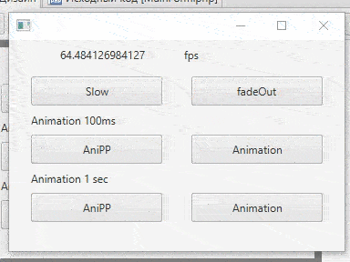

# dn-AniPP
Animation++ for DevelNext.

---

Api-docs: [English](https://github.com/illa4257/dn-AniPP/blob/master/api-docs/README.md)/[Русский](https://github.com/illa4257/dn-AniPP/blob/master/api-docs/README.ru.md)

---

Why is it better than Animation?
1. Animating a specific object value.
2. Synchronization with time.



3. Curves: Linear (bundle\anipp\Curves\Curve), EaseBack, EaseBackIn, EaseBackOut, EaseBounce, EaseBounceIn, EaseBounceOut, EaseCirc, EaseCircIn, EaseCircOut, EaseCubic, EaseCubicIn, EaseCubicOut, EaseCurve, EaseCurveIn, EaseCurveOut, EaseElastic, EaseElasticIn, EaseElasticOut, EaseExpo, EaseExpoIn, EaseExpoOut, EaseQuart, EaseQuartIn, EaseQuartOut, EaseQuint, EaseQuintIn, EaseQuintOut, EaseSine, EaseSineIn, EaseSineOut, SqrtCurve, SqrtCurveIn & SqrtCurveOut.
4. Custom animations.

---

Example:
```php
use bundle\anipp\AniPP;
use bundle\anipp\Curves\EaseCurve;

AniPP::smoothlySetValues($this->button, 100, ["opacity"=>0,"rotate"=>360], function (){
	echo "Ready!\n";
}, EaseCurve);
```

